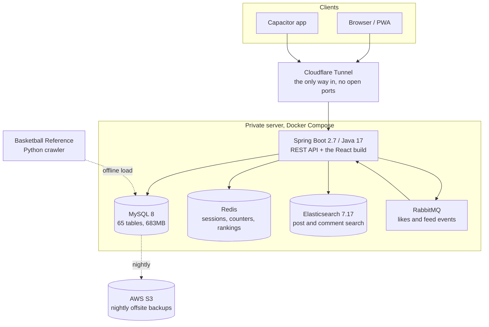

# Epoch

A full-stack community site I built and still run, live at **[dream-everything.com](https://www.dream-everything.com)**.

I started it in January 2024 while working in China, as a small forum on Spring Boot with server-rendered FreeMarker
and layui pages. After moving to Melbourne to study, I rebuilt it in stages: Java 8 to 17, the security basics, a
REST API and a React front end, with the site staying up the whole time. Today it has topic groups with group chat,
a recommended homepage feed, private messages, a personal schedule and an NBA stats section, all in an English
interface. Backups and uploads are moving to AWS in Sydney.

Java 17 + Spring Boot on the back, React 19 on the front, MySQL, Redis, RabbitMQ and Elasticsearch behind it,
running in Docker on a private server.

---

## What's in it

| Module | What it does |
|---|---|
| **Forum** | Topics with their own membership and permissions, posts, comments and nested replies, likes, favourites, polls, star ratings, tags, group chat, file sharing, full-text search |
| **Feed** | The homepage: For you, Latest and Following tabs, a topic filter and infinite scroll, with a reason on every card |
| **Messaging** | Private messages, a notification centre, and browser push |
| **Schedule** | Personal calendar with deadlines, repeating tasks and 8am reminders |
| **NBA stats** | 50 seasons of players, teams, games, box scores, playoffs, draft history, career totals, leaderboards and player comparison |
| **LoL records** | Match history pulled from the Riot API for a small group of players |
| **Admin** | User roles, per-user feature switches, ban and mute controls, player data editing |

The interface is English only. Posts, comments and chat stay in whatever language people wrote them in, which is
mostly Chinese.

---

## Architecture



The React app is built with Vite and served as static files by the same Spring Boot process, so there is one
container to deploy and no CORS to manage in production.

---

## Tech stack

**Backend** Java 17, Spring Boot 2.7, MyBatis-Plus, Spring Session (Redis-backed), WebSocket/STOMP for live
private messages, RabbitMQ, Elasticsearch, MySQL 8, scheduled jobs, AOP, web push over VAPID

**Frontend** React 19, Vite 8, Ant Design 5, React Router, service worker (PWA), Capacitor

**Infrastructure** Docker Compose, Cloudflare Tunnel, AWS S3 and IAM, Uptime Kuma, systemd timers,
Python 3 for the data pipeline

---

## Parts worth a look

**Running it in production**
The site is reachable through a Cloudflare Tunnel, so the machine has no inbound ports open at all. MySQL is
dumped nightly, verified (a truncated dump that still opens is the failure mode worth catching), then synced to
S3 with an IAM key that has no delete permission. I ran a restore drill and measured it: 24 hours of data at
risk, two minutes to recover.

**The recommended feed** (`service/FeedService.java`, `service/FeedRanker.java`)
The homepage ranks posts in three stages. Recall takes the newest, hot, owner-picked and followed-author posts;
ranking uses a hot score with a 7-day half-life (`utils/HotScore.java` keeps the only copy of the formula) and moves
posts the reader has already opened further down; reranking spreads topics out with a soft per-topic penalty.
Every card says why it is there. Private and unlisted topics only reach their owners and members, checked in SQL
and again in Java, with tests that push private, hidden and draft posts through a query that returns everything.
For you keeps its ranked order in Redis for 30 minutes so pages never repeat, while Latest and Following page with a
(time, id) cursor. Likes, comments, impressions and clicks are recorded in `user_event` through RabbitMQ, off the
request path.

**Finding the real bottleneck** (`src/main/resources/application-ubuntu.yml`)
The stats pages felt slow and I assumed it was SQL. It was not. One endpoint was sending 2.89MB of uncompressed
JSON while its query took 17ms, and the tunnel was carrying all of it. Turning on gzip in the app cut that hop to
roughly 390KB.

**From Chinese to English only**
The site started in Chinese. I first made it bilingual with react-i18next, using the Chinese text itself as the
key, then decided to drop Chinese, so the translation layer came out again. That meant touching about 1,700
`t()` calls, so I wrote an AST codemod (Babel plus magic-string) that inlines the English text and turns plural
keys into a singular/plural check. It also deletes the imports it leaves unused. The code was the easy part.
Values like a playoff result or an All-NBA tier are stored in MySQL and compared in code, so the comparisons, the
SQL, the NBA sync scripts and 3,260 stored rows have to change in the same release. The migration only touches
rows that still hold the old value, and I ran it once inside a transaction that rolls back, just to check the
row counts, before running it for real.

**Permissions**
Roles, per-user feature switches and per-topic membership are combined in one place, and there is a
single-session limit so one account cannot be shared. Sessions live in Redis, so a deploy does not log anyone out.

**The NBA data pipeline** (`tools/nba_sync/`)
A Python crawler pulls Basketball Reference season by season, normalises names and team codes, and loads MySQL.
It currently holds **1.21M box-score rows across 59,275 games from 1976 to 2026**, plus playoffs by round and by
game, 8,443 draft picks and 4,907 players. Career and season aggregates are computed once into their own tables,
so a player page reads a single row instead of grouping a million.

---

## Running it locally

You need JDK 17, Node 20+, and Docker.

```bash
# 1. dependencies: MySQL, Redis, RabbitMQ, Elasticsearch
docker compose -f docker-compose.dev.yml up -d

# 2. configuration. The defaults already match the dev compose file, so for a
#    local run you can copy it and change nothing.
cp .env.example .env

# 3. frontend
cd frontend && npm install && npm run dev     # http://localhost:5173

# 4. backend
./mvnw spring-boot:run -Dspring-boot.run.profiles=local   # http://localhost:8080
```

One extra step for search: the post and comment indices are mapped with the IK Chinese analyzer, so
Elasticsearch needs that plugin before the app first creates them. Download the `analysis-ik` release matching
7.17.16 and unzip it into `./es-plugins/analysis-ik/`, then start the stack.

The schema lives in `src/main/resources/mybatis/` alongside the mappers. The NBA tables are optional; without
them the forum still runs, the stats pages are just empty.

To build the way production does, which is one jar with the frontend inside it:

```bash
cd frontend && npm run build
cp -R frontend/dist/. src/main/resources/static/
./mvnw clean package -DskipTests
```

---

## Repo layout

```
src/main/java/com/dream/basketball/
    controller/    REST endpoints
    service/       service interfaces, plus the feed ranker, push senders and event logging
    impl/          service implementations
    mapper/        MyBatis mappers
    entity/ dto/   persistence and transfer objects
    job/           scheduled jobs (schedule reminders, LoL sync)
    config/        permissions, interceptors, RabbitMQ, Elasticsearch
src/main/resources/mybatis/   hand-written SQL
frontend/src/
    pages/         one folder per module
    components/    shared UI
    api/           axios wrappers
tools/nba_sync/    Python crawler and loaders
```

---

## Notes

Nothing sensitive is committed here. Passwords, API keys and tokens all come from environment variables at
runtime, and `.env.example` lists the ones the app looks for.

This is a personal project rather than a product. The live site holds real users' posts, so there is no database
dump in this repository.
